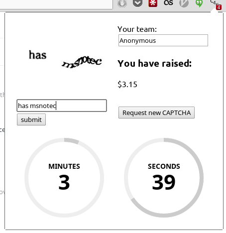

#captcha4charity
####Making the internet a worse place, making the world a better place.
######Daniel Bordak and Revan Sopher, HackRU Spring 2014

A service for crowd-sourcing [CAPTCHA](www.captcha.net) challenges and raising money for charity.

Customers submit images to solve and credit card information to an API, whereupon the images are distributed to workers running a Chrome extension. Upon successful solution of a challenge, the customer is charged.

Customers may report unsuccessful solutions, nullifying the payment, to protect against abuse by workers.

Jobs are stored in a priority queue implemented within MongoDB, sorted by due date, in a [Shortest Remaining Time First](http://en.wikipedia.org/wiki/Shortest_remaining_time) scheduling algorithm.

####TODO
-	Protect against abuse of solution reporting
-	Polish server/extension communications
-	Hook in [FirstGiving API](firstgiving.com) (multi-day registration process for API keys)

This repository consists of the Chrome extension for solving images.

[This repository](https://github.com/dbordak/captcha4charity-server) holds the D server that serves the API.
